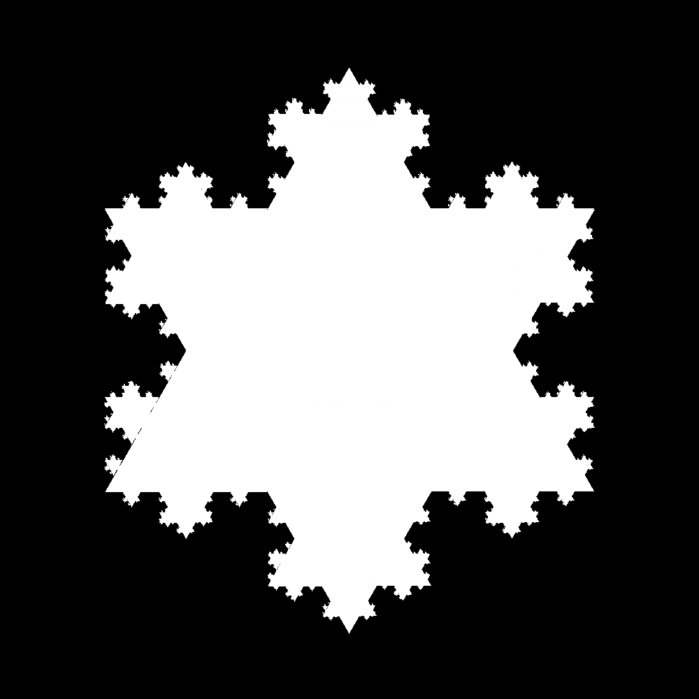

# canvas-drawer

Implements a simple drawing api

\

## How to build

*Windows*

Open git bash to the directory containing this repository.

```
canvas-drawer $ mkdir build
canvas-drawer $ cd build
canvas-drawer/build $ cmake -G "Visual Studio 16 2019" ..
canvas-drawer/build $ start Draw-2D.sln
```

Your solution file should contain two projects: `pixmap_art` and `pixmap_test`.
To run from the git bash command shell, 

```
canvas-drawer/build $ ../bin/Debug/draw_test
canvas-drawer/build $ ../bin/Debug/draw_art
```

*macOS*

Open terminal to the directory containing this repository.

```
canvas-drawer $ mkdir build
canvas-drawer $ cd build
canvas-drawer/build $ cmake ..
canvas-drawer/build $ make
```

To run each program from build, you would type

```
canvas-drawer/build $ ../bin/draw_test
canvas-drawer/build $ ../bin/draw_art
```

## Supported primitives

1. Point\
\
2. Line\
\
3. Triangle\
\

## Composite shapes

1. Circle\
\
2. Rectangle\
\
3. Star\
\
4. Snowflake\
\
5. Rose\
\

## Results

\
\
\
\
\
\

