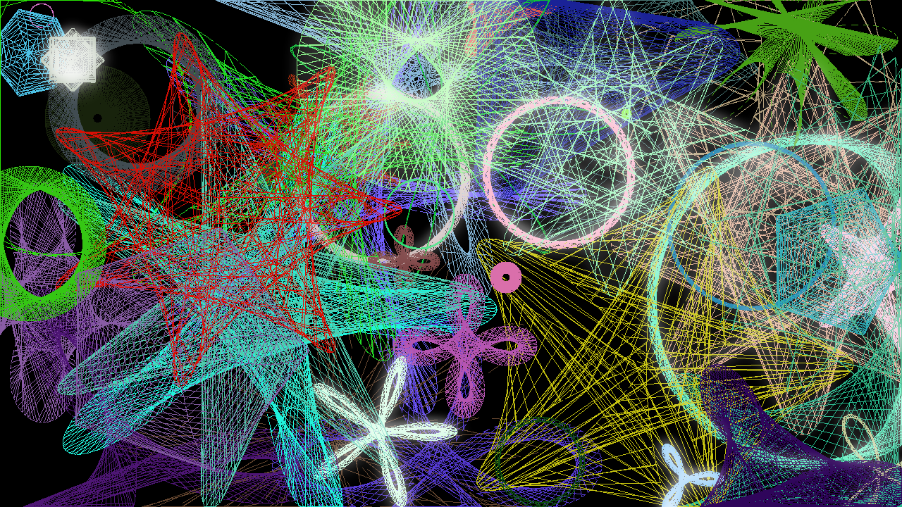
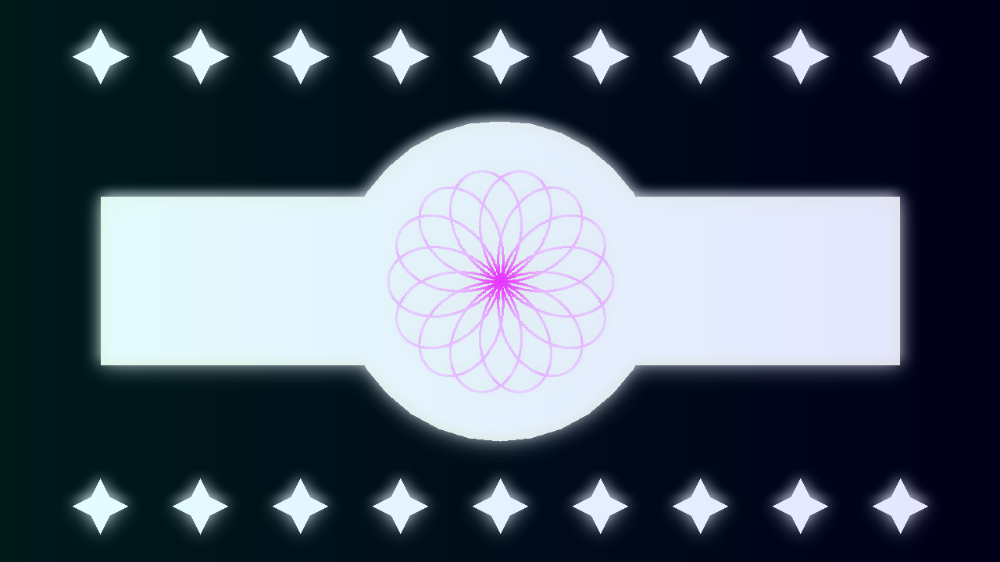
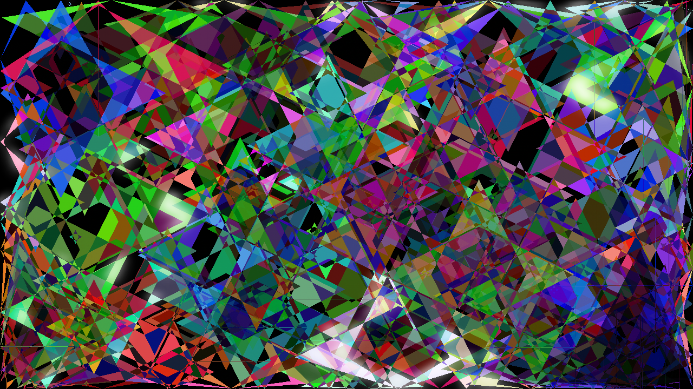

# canvas-drawer

Implements a simple drawing api



## How to build

*Windows*

Open git bash to the directory containing this repository.

```
canvas-drawer $ mkdir build
canvas-drawer $ cd build
canvas-drawer/build $ cmake -G "Visual Studio 16 2019" ..
canvas-drawer/build $ start Draw-2D.sln
```

To run from the git bash command shell, 

```
canvas-drawer/build $ ../bin/Debug/draw_test
canvas-drawer/build $ ../bin/Debug/draw_art
```

*macOS*

Open terminal to the directory containing this repository.

```
canvas-drawer $ mkdir build
canvas-drawer $ cd build
canvas-drawer/build $ cmake ..
canvas-drawer/build $ make
```

To run each program from build, you would type

```
canvas-drawer/build $ ../bin/draw_test
canvas-drawer/build $ ../bin/draw_art
```

## Supported primitives

1. Point

2. Line

3. Triangle


## Composite shapes

1. Circle

2. Rectangle

3. Star

4. Rose

5. Snowflake


## Features

1. Outlined shapes


2. Blend modes - Replace, add, difference, or average

3. Variable line width


## Results







